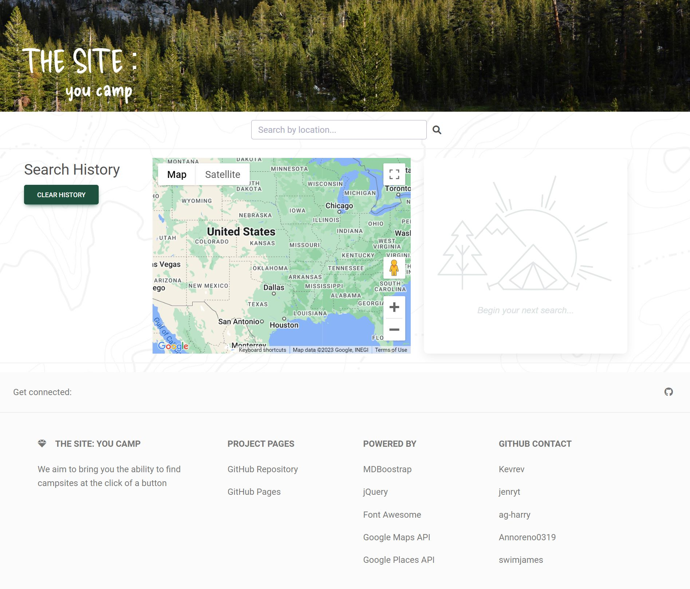

# The Site: You Camp

## Description

The Site aims to provide users with a quick and easy way to locate campgrounds and their details based on a location search. Built on MDBootstrap, the website utilizes Google Maps API and Google Places API to receive a user input, derive a proper location from it, and find campgrounds within a 50 kilometer radius of the area. An autocomplete function helps to locate a users desired location better before they search. From there, the Google Places service populates dynamically generated cards and contains information (if available) pertinent to a user searching for a location to possibly camp at: image, name, address, phone number, website link, and a user rating. The cards can be clicked on to focus the map on the corresponding marker. Similarly, the marker can be clicked on to bring up a smaller revelant information window with a link to view on Google Maps. Users searches are stored locally and displayed on the left side of the page, with a clear history button to remove them if desired. The footer contains relevant information regarding the technologies used on the site as well as links to the repository and individuals within that repository.

## Usage

Users are greeted with a search bar from which they can enter different kinds of addresses. Markers on the map and information cards are dynamically generated after the user presses enter. From there, they can scroll up and down on the cards list, interact with cards, or interact with the map in a similar capacity to Google Maps. When a user finds a campground that interests them, they can open the relevant website to plan their camping trip.

Link to the deployed website itself:

https://kevrev.github.io/the-site/

One can also view the index.html, script.js, and style.css files independently in the GitHub repository:

https://github.com/Kevrev/the-site

## Technology Used

[MDBootstrap](https://mdbootstrap.com/)

[jQuery](https://jquery.com/)

[Font Awesome](https://fontawesome.com/)

[Google Maps API](https://developers.google.com/maps/documentation/javascript/overview)

[Google Places API](https://developers.google.com/maps/documentation/places/web-service/overview)

## Credits

Traversy Media on [YouTube](https://www.youtube.com/watch?v=Zxf1mnP5zcw) for his thorough explanation on the basics of implementing Google Maps JavaScript API. Though the documentaion on google covered much of the same, his tutorial provided a reinforcement of the ideas provided through the documentation as well as seeing it built firsthand. 

Google themselves on [Google Maps Platform](https://developers.google.com/maps/documentation/javascript/tutorials) for not just their thorough documentation, but their sample code as well which provided a good foundation from which to build from in the initial stages of the project. It was an excellent jumping off point to understand how various parts of the code worked and what the API could do.
